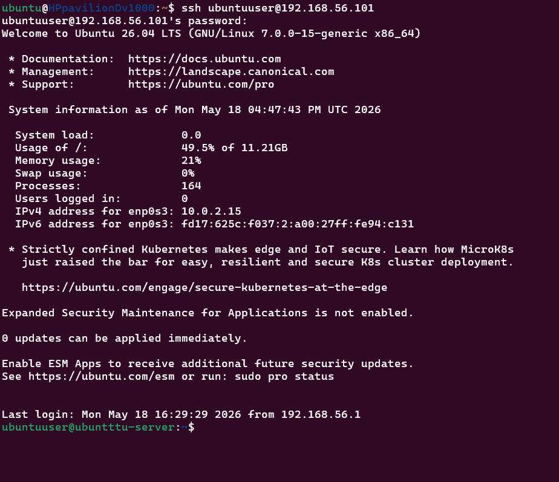
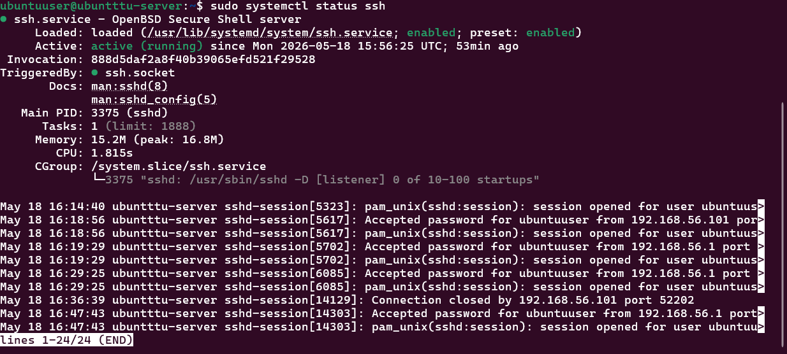
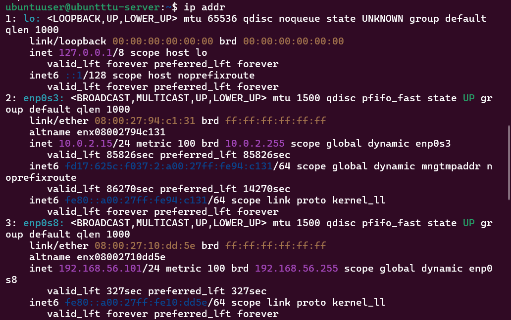
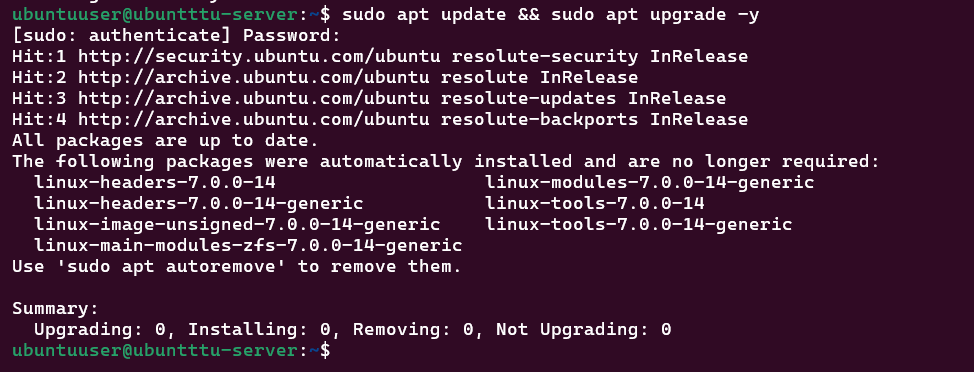

# Week 1 Journal

# Objectives

- Install Ubuntu Server in VirtualBox
- Configure networking
- Enable SSH access
- Verify remote administration
- Update system packages

---

# Ubuntu Server Installation

Installed Ubuntu Server using:

- Oracle VirtualBox
- Ubuntu Server ISO

Configured:
- 2 GB RAM
- 1 CPU
- 25 GB virtual disk

Enabled:
- OpenSSH Server during installation

---

# SSH Configuration

Verified SSH service using:

```bash
sudo systemctl status ssh
```

Purpose:
- allow remote administration
- secure server management

---

# Network Configuration

Checked network interfaces using:

```bash
ip addr
```

Verified:
- server IP address
- network connectivity

---

# System Update

Updated packages using:

```bash
sudo apt update && sudo apt upgrade -y
```

Purpose:
- install latest security patches
- update system packages

---

# Remote Administration

Connected remotely from host machine using:

```bash
ssh ubuntuuser@192.168.56.101
```

Verified:
- successful SSH login
- remote terminal access

---

# Screenshots

## SSH Login



---

## SSH Service Status



---

## Network Information



---

## System Update



---

# Reflection

This phase improved understanding of:
- Linux server installation
- VirtualBox configuration
- SSH remote administration
- network configuration
- system updates
