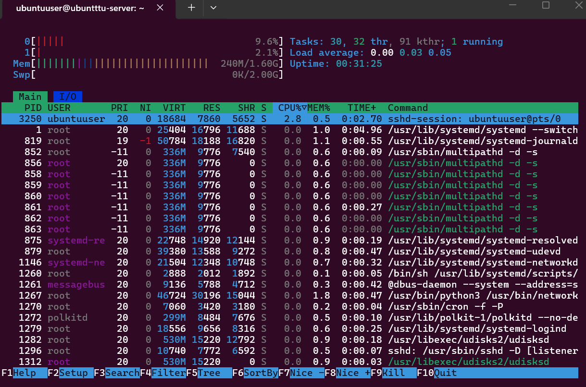
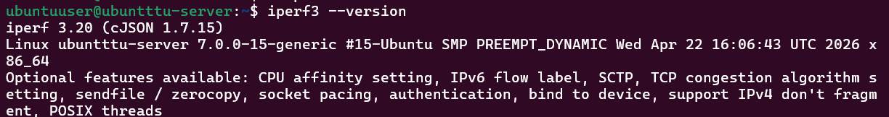
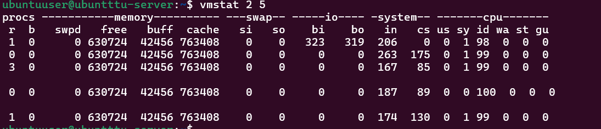

# Week 2 Journal

# Objectives

- Install monitoring tools
- Install testing tools
- Verify system monitoring
- Plan security testing methodology

---

# Monitoring Tools Installed

The following monitoring tools were installed:

```bash
sudo apt install htop sysstat net-tools curl wget git -y
```

These tools were used for:
- CPU monitoring
- memory monitoring
- network analysis
- system diagnostics

---

# Network Testing Tools

Installed:

```bash
sudo apt install iperf3 nmap -y
```

Purpose:
- network performance testing
- network security scanning

---

# Stress Testing Tools

Installed:

```bash
sudo apt install stress-ng fio -y
```

Purpose:
- CPU stress testing
- RAM testing
- disk I/O testing

---

# Verification Commands

```bash
htop
iperf3 --version
stress-ng --version
fio --version
ifconfig
vmstat 2 5
iostat
netstat -tulnp
```

---

# Security Configuration Checklist

| Security Control | Status | Purpose |
|---|---|---|
| OpenSSH Installed | Completed | Remote administration |
| SSH Enabled | Completed | Remote access |
| Monitoring Tools | Completed | System monitoring |
| Network Testing Tools | Completed | Network testing |
| Stress Testing Tools | Completed | Performance testing |
| Firewall | Planned | Restrict access |
| fail2ban | Planned | Brute-force protection |

---

# Threat Model

| Threat | Risk | Mitigation |
|---|---|---|
| SSH brute-force attack | Unauthorized access | fail2ban |
| Weak passwords | Credential compromise | SSH keys |
| Open network ports | Increased attack surface | Firewall rules |
| Malware | System compromise | AppArmor |

---

# Testing Methodology

## CPU Testing
- stress-ng
- htop

## Memory Testing
- free -h
- vmstat

## Disk Testing
- fio
- iostat

## Network Testing
- iperf3
- netstat
- ifconfig

---

# Screenshots

## htop



---

## iperf3



---

## vmstat



---

# Reflection

This phase improved understanding of:
- Linux monitoring tools
- system performance testing
- network analysis
- security planning
- threat assessment
