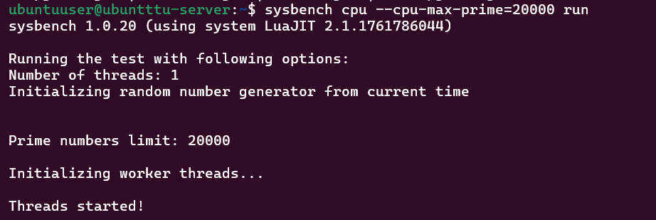
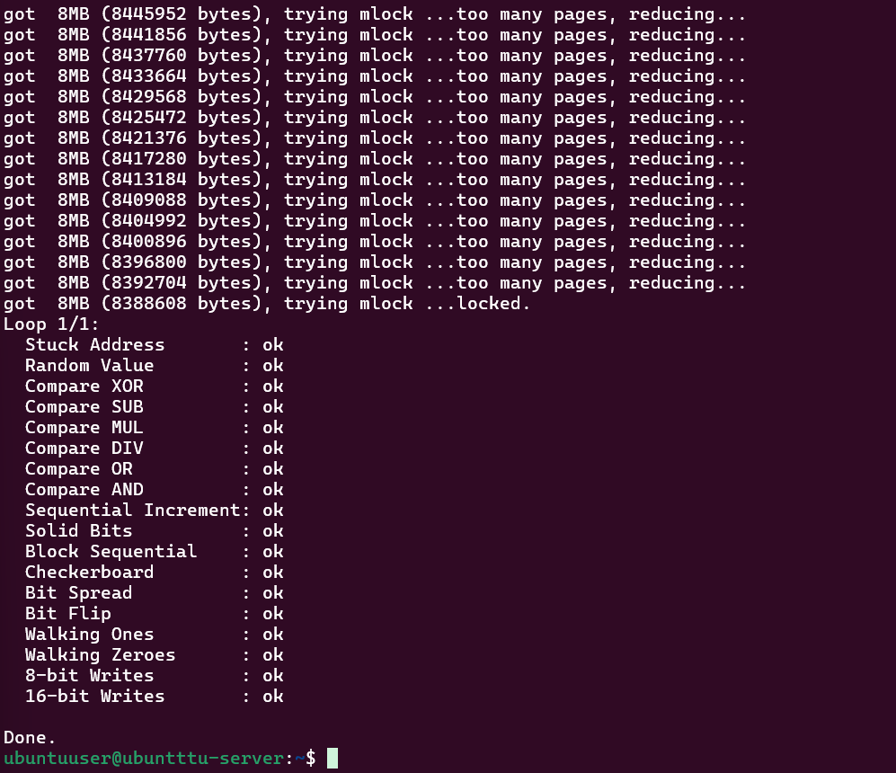
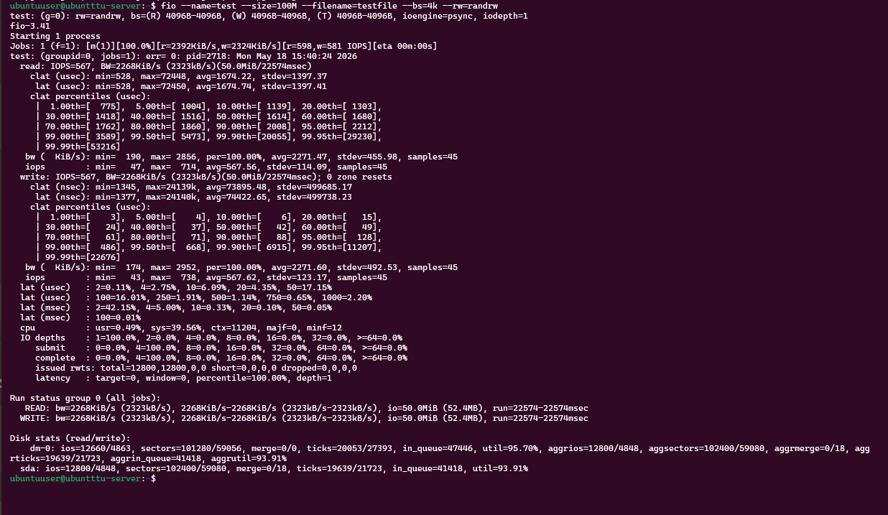
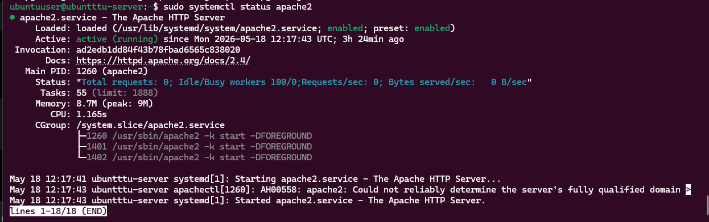
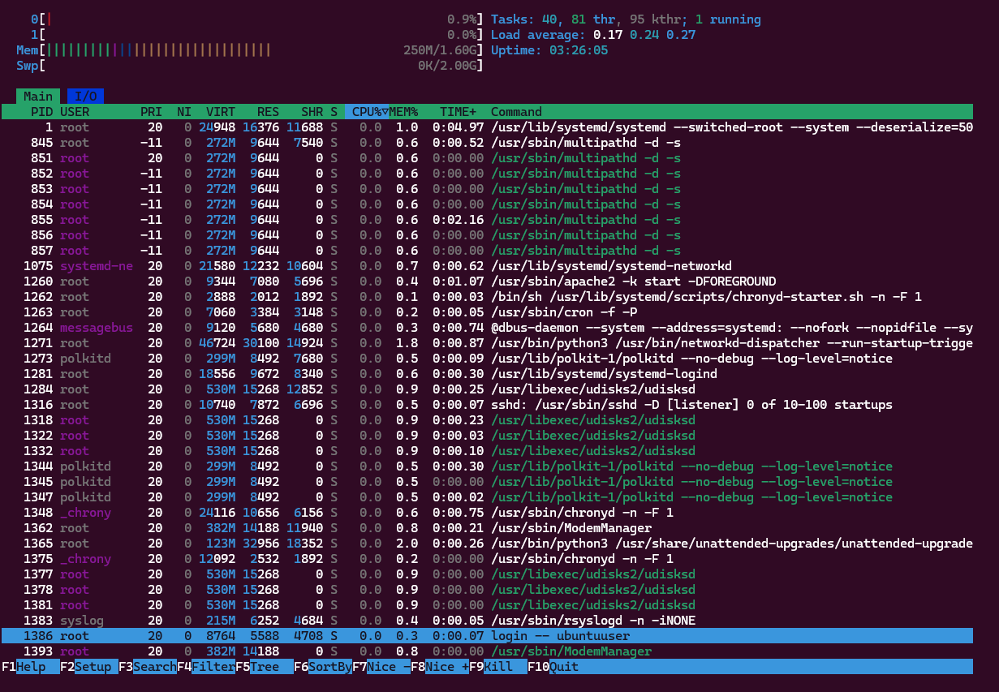

# Week 3 Journal

# Objectives

- Install workload applications
- Perform CPU testing
- Perform memory testing
- Perform disk I/O testing
- Configure server workloads
- Monitor system resource usage

---

# CPU Intensive Testing

Installed tools:

```bash
sudo apt install stress-ng sysbench -y
```

CPU benchmark command:

```bash
sysbench cpu --cpu-max-prime=20000 run
```

Purpose:
- CPU benchmarking
- workload simulation
- processor stress testing

---

# RAM Intensive Testing

Installed tool:

```bash
sudo apt install memtester -y
```

Memory testing command:

```bash
memtester 100M 1
```

Purpose:
- RAM testing
- memory stability verification

---

# Disk I/O Testing

Installed tools:

```bash
sudo apt install fio iotop -y
```

Disk test command:

```bash
fio --name=test --size=100M --filename=testfile --bs=4k --rw=randrw
```

Purpose:
- disk performance testing
- read/write benchmarking
- I/O workload simulation

---

# Network & Server Workloads

Installed applications:

```bash
sudo apt install iperf3 nmap apache2 -y
```

Purpose:
- network testing
- service testing
- web server workload simulation

---

# Monitoring Commands Used

```bash
htop
sudo iotop
free -h
uptime
sudo netstat -tulnp
```

These commands were used to monitor:
- CPU usage
- memory usage
- disk activity
- system load
- open network ports

---

# Workload Categories

| Workload Type | Tool Used |
|---|---|
| CPU-intensive | sysbench |
| RAM-intensive | memtester |
| Disk-intensive | fio |
| Network-intensive | iperf3 |
| Server workload | apache2 |

---

# Screenshots

## CPU Benchmark



---

## Memory Test



---

## Disk I/O Test



---

## Apache Server



---

## Resource Monitoring



---

# Reflection

This phase improved understanding of:
- workload simulation
- Linux benchmarking
- CPU and memory testing
- disk I/O analysis
- server workload behaviour
- performance monitoring
