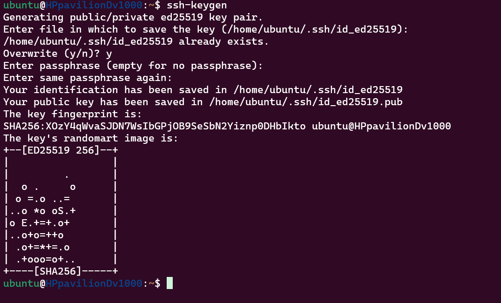
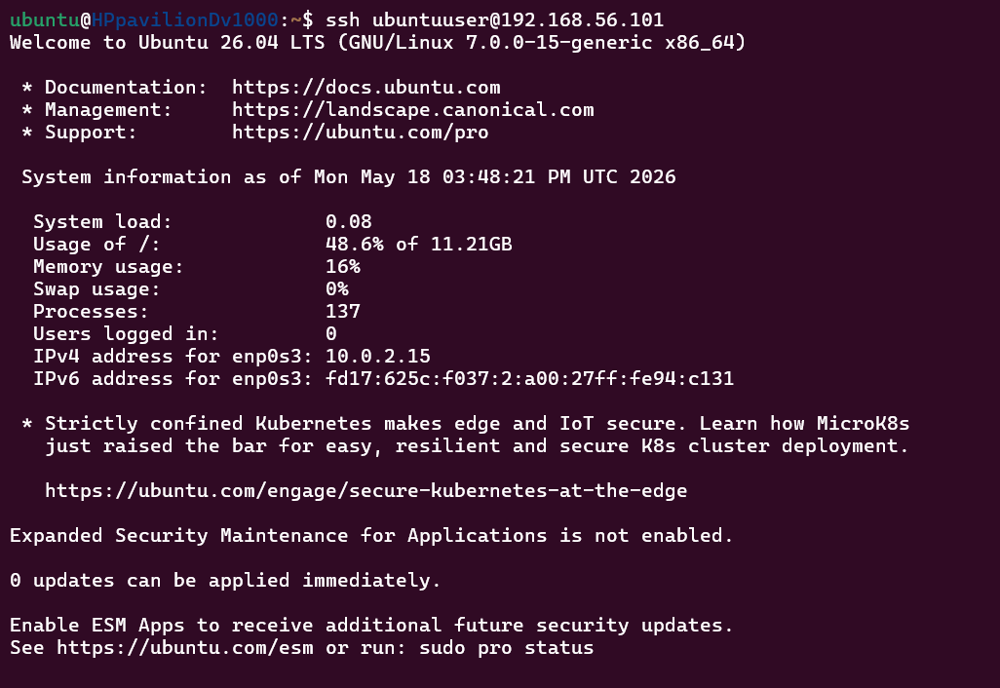
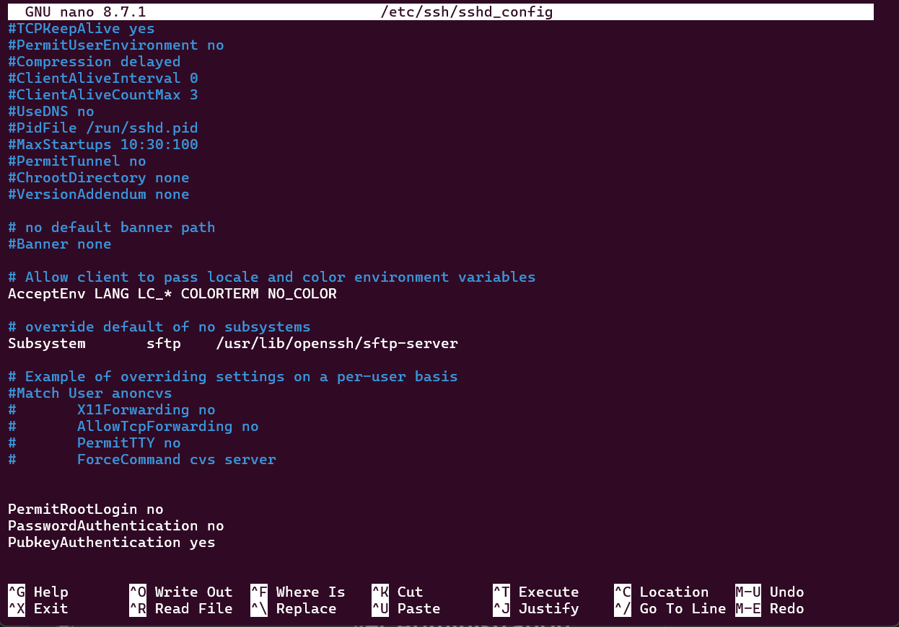
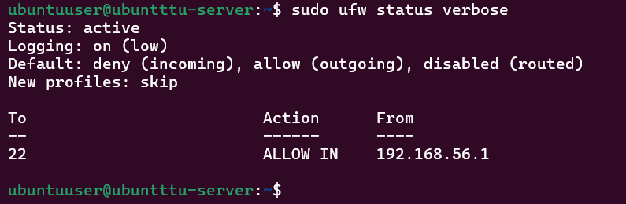

# Week 4 Journal

# Objectives

- Configure SSH key authentication
- Enable passwordless SSH
- Harden SSH configuration
- Configure firewall rules
- Create administrative users
- Verify remote administration

---

# SSH Key Configuration

Generated SSH keys using:

```bash
ssh-keygen
```

SSH keys were copied to the server using:

```bash
ssh-copy-id ubuntuuser@192.168.56.101
```

Purpose:
- secure authentication
- eliminate password-based login
- improve SSH security

---

# Passwordless SSH Verification

Verified remote login without password using:

```bash
ssh ubuntuuser@192.168.56.101
```

This confirmed:
- public key authentication functioning correctly
- secure remote administration enabled

---

# SSH Hardening

Modified SSH configuration file:

```bash
sudo nano /etc/ssh/sshd_config
```

Security settings applied:

```text
PermitRootLogin no
PasswordAuthentication no
PubkeyAuthentication yes
```

Purpose:
- disable insecure root login
- disable password authentication
- enforce SSH key authentication

---

# SSH Service Verification

Restarted SSH service:

```bash
sudo systemctl restart ssh
```

Verified status:

```bash
sudo systemctl status ssh
```

---

# Firewall Configuration

Installed UFW firewall:

```bash
sudo apt install ufw -y
```

Configured SSH access rule:

```bash
sudo ufw allow from 192.168.56.1 to any port 22
```

Enabled firewall:

```bash
sudo ufw enable
```

Verified firewall status:

```bash
sudo ufw status verbose
```

Purpose:
- restrict network access
- protect SSH service
- reduce attack surface

---

# User Administration

Created administrative user:

```bash
sudo adduser adminuser
```

Granted sudo access:

```bash
sudo usermod -aG sudo adminuser
```

Verified group membership:

```bash
groups adminuser
```

---

# Remote Administration Verification

Verified secure remote administration using:

```bash
whoami
hostname
ip addr
```

This confirmed:
- remote system access
- correct network configuration
- administrative functionality

---

# Screenshots

## SSH Key Generation



---

## Passwordless SSH



---

## SSH Hardening



---

## Firewall Status



---

## User Management


---

# Reflection

This phase improved understanding of:
- SSH key authentication
- secure remote administration
- Linux firewall management
- access control
- SSH hardening techniques
- user privilege management
