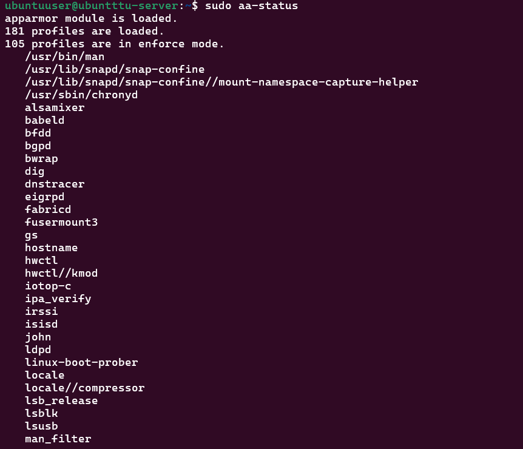
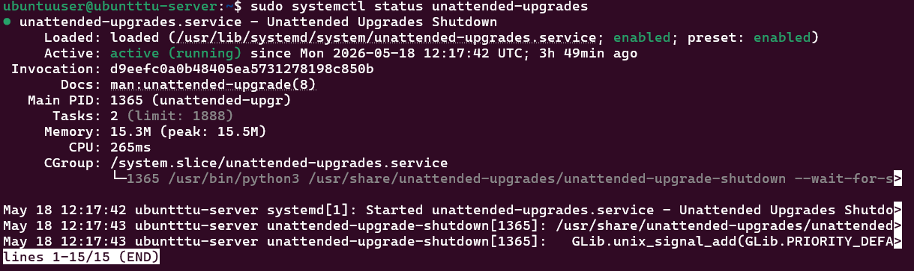
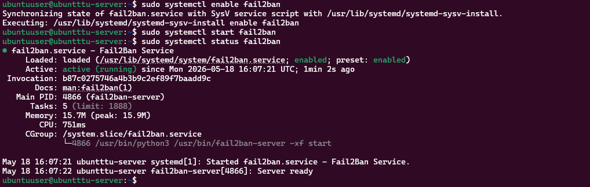
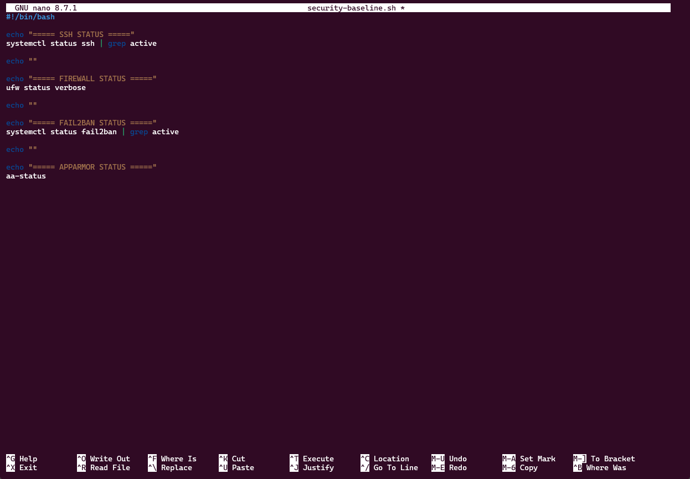
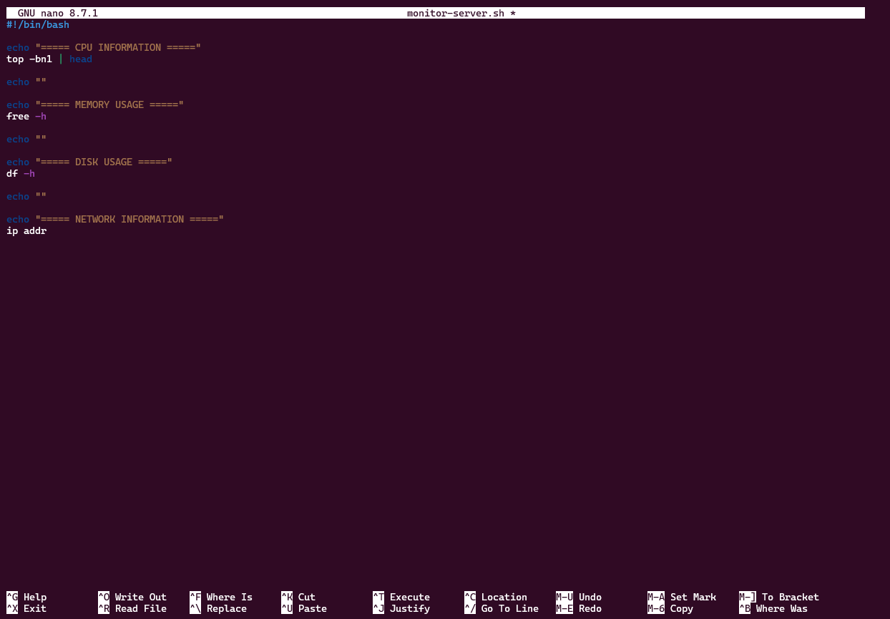

# Week 5 Journal

# Objectives

- Verify AppArmor security framework
- Configure automatic security updates
- Install fail2ban intrusion prevention
- Create security verification scripts
- Create monitoring automation scripts
- Verify security infrastructure

---

# AppArmor Verification

Verified AppArmor status using:

```bash
sudo aa-status
```

Purpose:
- mandatory access control
- process confinement
- security enforcement

---

# Automatic Security Updates

Installed unattended upgrades:

```bash
sudo apt install unattended-upgrades -y
```

Configured automatic updates:

```bash
sudo dpkg-reconfigure unattended-upgrades
```

Verified service status:

```bash
sudo systemctl status unattended-upgrades
```

Purpose:
- automatic security patching
- reduce vulnerability exposure
- improve system maintenance

---

# fail2ban Configuration

Installed fail2ban:

```bash
sudo apt install fail2ban -y
```

Enabled service:

```bash
sudo systemctl enable fail2ban

sudo systemctl start fail2ban
```

Verified service:

```bash
sudo systemctl status fail2ban
```

Purpose:
- brute-force protection
- SSH attack mitigation
- intrusion prevention

---

# Security Verification Script

Created script:

```bash
nano security-baseline.sh
```

Made executable:

```bash
chmod +x security-baseline.sh
```

Executed script:

```bash
./security-baseline.sh
```

Purpose:
- verify security services
- automate security checks
- simplify system auditing

---

# Monitoring Script

Created script:

```bash
nano monitor-server.sh
```

Made executable:

```bash
chmod +x monitor-server.sh
```

Executed script:

```bash
./monitor-server.sh
```

Purpose:
- monitor CPU usage
- monitor memory usage
- monitor disk usage
- monitor network configuration

---

# Security Verification Commands

```bash
sudo fail2ban-client status

sudo ufw status verbose

sudo systemctl status ssh
```

These commands verified:
- firewall status
- SSH service
- fail2ban protection
- overall security posture

---

# Screenshots

## AppArmor Status



---

## Automatic Updates



---

## fail2ban Status



---

## Security Script



---

## Monitoring Script



---

# Reflection

This phase improved understanding of:
- Linux security automation
- intrusion prevention
- automated patch management
- AppArmor security controls
- monitoring automation
- security verification scripting
