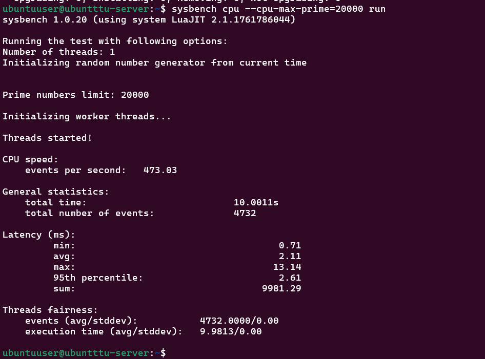
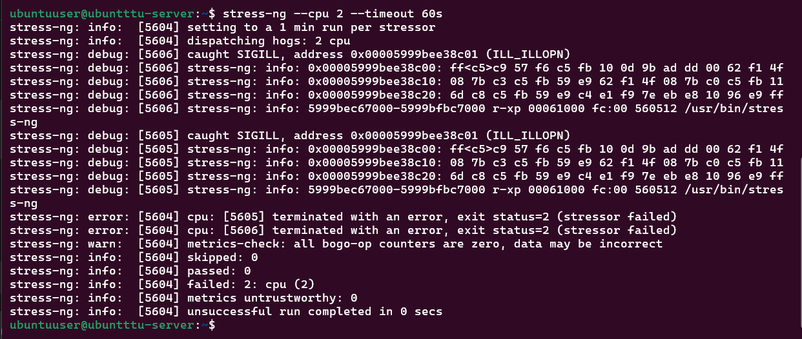
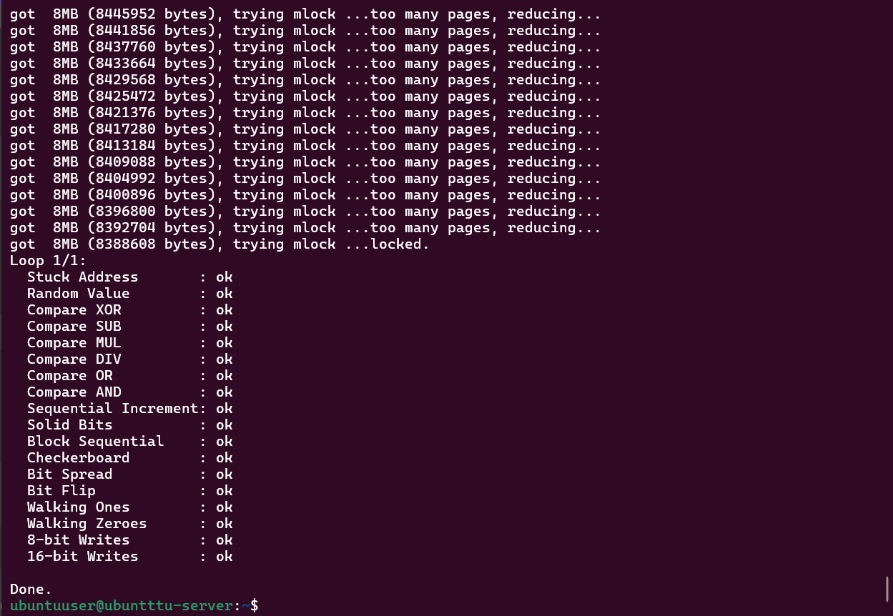
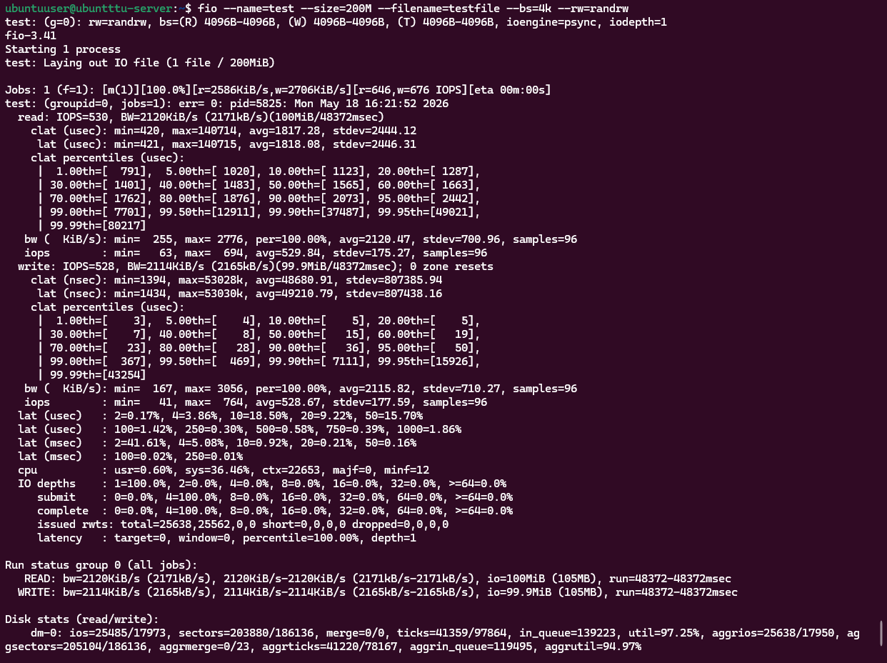
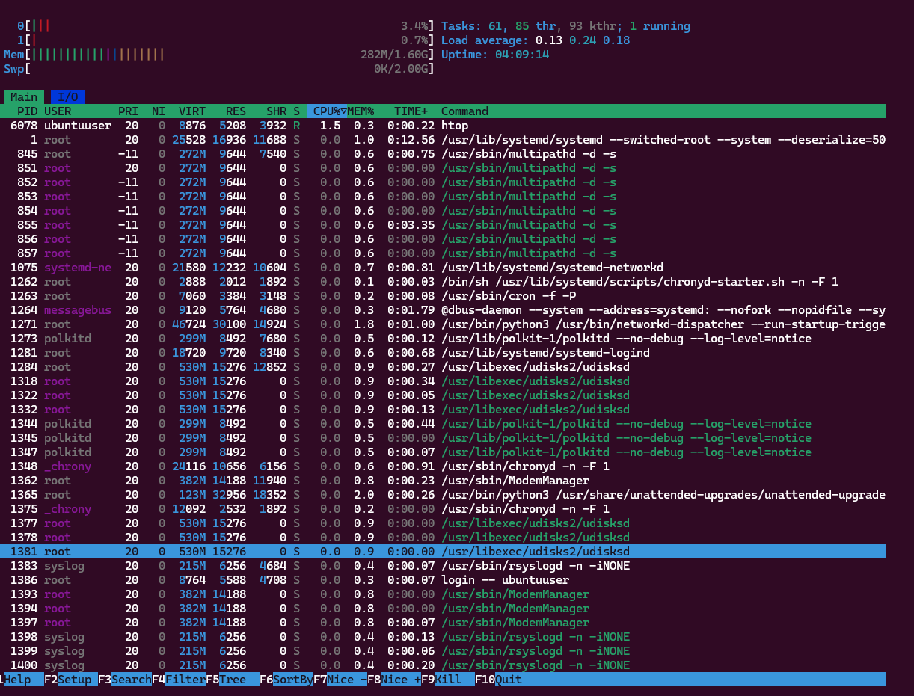

# Week 6 Journal

# Objectives

- Perform system benchmarking
- Analyse CPU performance
- Analyse memory performance
- Analyse disk I/O performance
- Analyse network behaviour
- Identify bottlenecks
- Perform optimisation testing

---

# CPU Performance Testing

Performed CPU benchmark using:

```bash
sysbench cpu --cpu-max-prime=20000 run
```

Performed CPU stress testing:

```bash
stress-ng --cpu 2 --timeout 60s
```

Monitored CPU activity using:

```bash
htop
```

Purpose:
- evaluate processor performance
- simulate workload pressure
- monitor CPU utilisation

---

# Memory Performance Testing

Performed RAM testing using:

```bash
memtester 200M 1
```

Verified memory usage:

```bash
free -h
```

Purpose:
- memory stability testing
- RAM usage analysis
- memory allocation verification

---

# Disk I/O Performance Testing

Performed disk benchmark:

```bash
fio --name=test --size=200M --filename=testfile --bs=4k --rw=randrw
```

Monitored disk activity:

```bash
sudo iotop
```

Purpose:
- read/write benchmarking
- IOPS analysis
- latency monitoring
- disk workload simulation

---

# Network Analysis

Verified network tools:

```bash
iperf3 --version
```

Reviewed network configuration:

```bash
ifconfig
```

Purpose:
- network verification
- throughput analysis
- network diagnostics

---

# System Monitoring

Collected system performance statistics using:

```bash
vmstat 2 5

iostat

uptime
```

These commands were used to monitor:
- CPU wait time
- swap activity
- disk statistics
- load averages
- process scheduling

---

# Apache Workload Testing

Verified Apache server:

```bash
sudo systemctl status apache2
```

Reviewed open services:

```bash
sudo netstat -tulnp
```

Purpose:
- simulate server workloads
- analyse service behaviour
- verify network services

---

# Optimisation Testing

Performed cache optimisation:

```bash
sudo sync

sudo sysctl -w vm.drop_caches=3
```

Restarted Apache service:

```bash
sudo systemctl restart apache2
```

Purpose:
- clear filesystem cache
- optimise memory usage
- refresh server processes

---

# Bottleneck Analysis

Potential bottlenecks identified:
- high CPU usage during stress tests
- increased memory usage under workload
- disk latency during fio benchmarking

Monitoring tools used:
- htop
- iotop
- vmstat
- iostat

---

# Screenshots

## CPU Benchmark



---

## CPU Stress Test



---

## RAM Test



---

## Disk Benchmark



---

## Resource Monitoring



---

# Reflection

This phase improved understanding of:
- Linux benchmarking
- workload analysis
- performance bottlenecks
- resource optimisation
- system monitoring
- infrastructure evaluation
