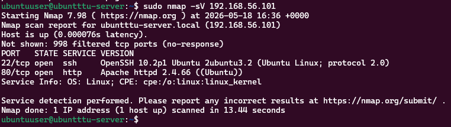
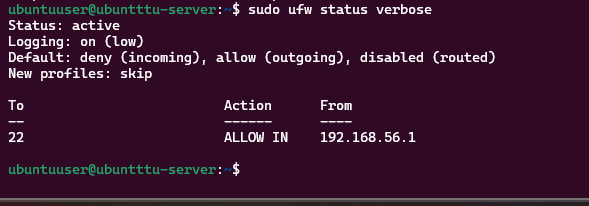
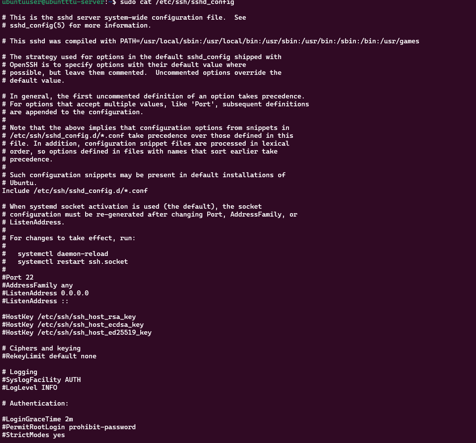
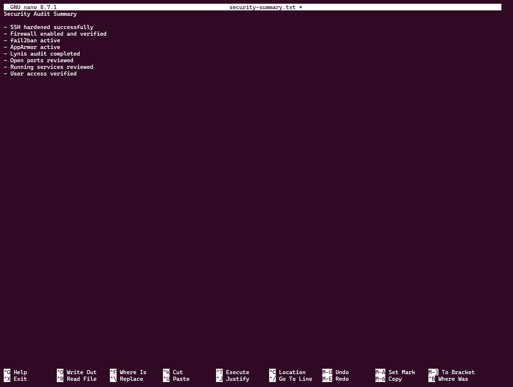

# Week 7 Journal

# Objectives

- Perform security auditing
- Evaluate network exposure
- Verify firewall protection
- Review SSH security configuration
- Analyse running services
- Review user access controls
- Evaluate overall security posture

---

# Lynis Security Audit

Installed Lynis security auditing framework:

```bash
sudo apt install lynis -y
```

Performed full system audit:

```bash
sudo lynis audit system
```

Purpose:
- vulnerability assessment
- system hardening analysis
- security recommendations
- compliance evaluation

---

# Lynis Report Review

Reviewed generated audit report:

```bash
sudo cat /var/log/lynis-report.dat
```

The report included:
- warnings
- suggestions
- security score
- system recommendations

---

# Network Security Assessment

Performed localhost scan:

```bash
nmap localhost
```

Performed service version scan:

```bash
sudo nmap -sV 192.168.56.101
```

Purpose:
- identify open ports
- analyse exposed services
- verify network security

---

# Firewall Verification

Verified firewall rules:

```bash
sudo ufw status verbose
```

Confirmed:
- firewall active
- SSH access controlled
- network filtering functioning correctly

---

# SSH Security Review

Verified SSH service:

```bash
sudo systemctl status ssh
```

Reviewed SSH configuration:

```bash
sudo cat /etc/ssh/sshd_config
```

Verified:
- root login disabled
- password authentication disabled
- public key authentication enabled

---

# Running Services Review

Reviewed active services:

```bash
systemctl list-units --type=service --state=running
```

Reviewed network services:

```bash
sudo netstat -tulnp
```

Purpose:
- identify active daemons
- evaluate attack surface
- verify required services only

---

# User & Access Review

Reviewed system accounts:

```bash
cat /etc/passwd
```

Verified administrative privileges:

```bash
groups adminuser
```

Purpose:
- review access control
- verify sudo permissions
- analyse user accounts

---

# Security Protection Verification

Verified fail2ban:

```bash
sudo fail2ban-client status
```

Verified AppArmor:

```bash
sudo aa-status
```

Purpose:
- intrusion prevention validation
- mandatory access control verification
- confirm security protections active

---

# Security Summary

Created summary file:

```bash
nano security-summary.txt
```

Reviewed summary:

```bash
cat security-summary.txt
```

Summary included:
- SSH hardening
- firewall protection
- fail2ban status
- AppArmor verification
- audit completion

---

# Screenshots

## Lynis Audit


---

## Network Scan



---

## Firewall Verification



---

## SSH Verification



---

## Security Summary



---

# Reflection

This phase improved understanding of:
- Linux security auditing
- vulnerability assessment
- network exposure analysis
- firewall verification
- service auditing
- SSH security review
- system hardening evaluation
